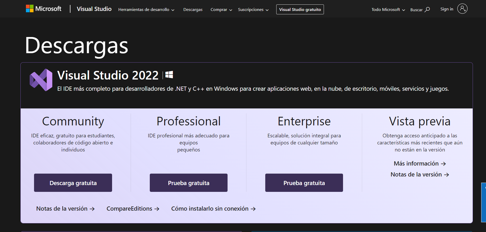
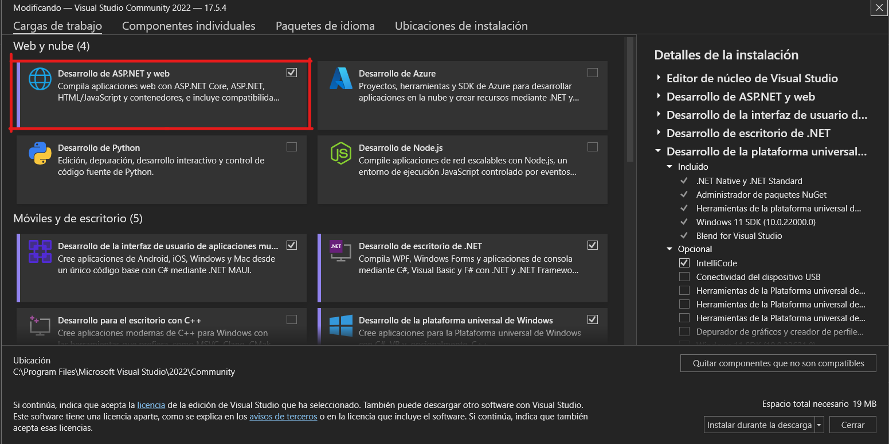
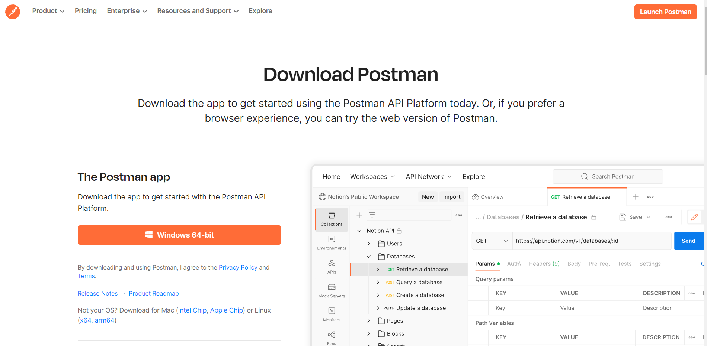
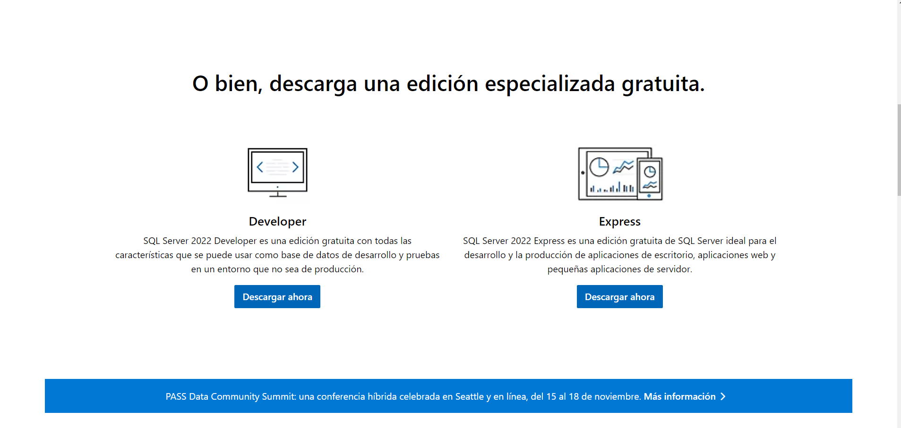
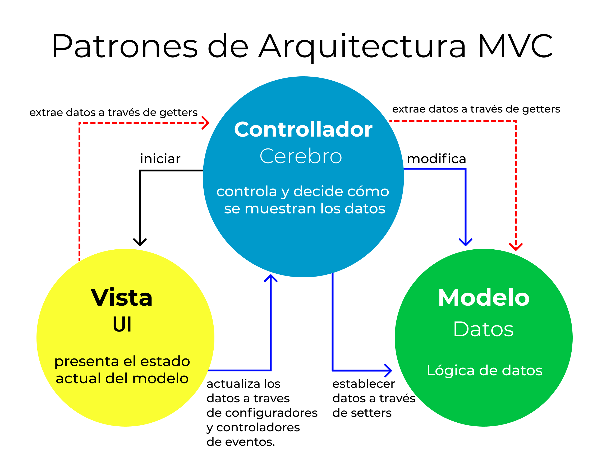

# Instalaciones necesarias

## Visual Studio 2022

### Descargar e instalar Visual Studio 

Si ya tienes instalado visual studio 2022 abre **Visual Studio Installer** para verificar las configuraciones necesarias, si no tinens **Viusal Studio Installer** descargalo a continuación.

1. Visita la [página oficial](https://visualstudio.microsoft.com/es/downloads/) y descarga el instalador.
   


2. Ejecuta el programa que se acaba de descargar. Si ya tienes instalado **Visual Studio 2022** presiona **Modificar**. Si es la primera instalación presiona instalar.

3. A continuación verifica que la opción **Desarrollo de ASP.NET y web** esté marcada e inicia la instalación.



## Post Man

### Descargar e instalar Post Man

1.  Visita la [página oficial](https://www.postman.com/downloads/) y descarga el instalador.



2. Una vez descaragado el instalador, ejecutalo y sigue los pasos para finalizar la instalación.

## SQL Server 

1.  Visita la [página oficial](https://www.microsoft.com/es-es/sql-server/sql-server-downloads) y descarga el instalador.



2. Una vez descaragado el instalador, ejecutalo y sigue los pasos para finalizar la instalación.

# Introducción a .NET Core

## ¿Qué es .NET Core?

Es la plataforma de desarrollo de Microsoft más moderna, de código fuente abierto, multiplataforma y de alto rendimiento para la creación de todo tipo de aplicaciones.

Al ser multiplataforma, no depende de cosas específicas del sistema operativo, como sucede con el .NET Framework.

## Características de .Net Core

* Es multiplataforma y viene con soporte para su uso con contenedores Docker.
* Alto rendimiento. Se ha desarrollado desde cero y se le ha dado una alta importancia a esta característica.
* Asincronía con el uso de async/await. Se ha implementado este patrón en todas las librerías comunes para mejorar el rendimiento en las llamadas I/O.
* Es Open Source.

## ¿Para qué sirve .NET Core?

Nos permite realizar todo tipo de aplicaciones.

* Aplicaciones web que podrás desplegar en Windows, Linux, Mac Os. Podrás desplegar tus aplicaciones usando contenedores Docker en distintas plataformas Cloud como Azure, Amazon, GCP.
* Aplicaciones de escritorio UWP que te permitirá correr tu aplicación en Windows 10, XBOX y HoloLens compartiendo el código y sin tener que reescribir tus bibliotecas.
* Internet Of Things, Inteligencia Artificial, desarrollo de juegos.

## ¿Qué lenguajes puedo usar en .NET Core?

* **C#:** Es un lenguaje de programación multiparadigma y muy sofisticado que ha evolucionado en conjunto con la estrategia de .NET.Tiene nuevas características, como tipos por referencia nullables, rangos, índices, streams asíncronos… es la opción por defecto a la hora de crear aplicaciones en .NET Core y de la que más documentación vas a encontrar.

* **F#:** Es un lenguaje funcional que ha ido creciendo desde su creación en el año 2005. Con características únicas y potentes, puede ser usado para crear cualquier tipo de solución de software y además, cuenta con una comunidad muy activa.

* **Visual Basic:** También aparece como una opción para crear soluciones con .NET, pero te puedo adelantar que Microsoft ha decidido no seguir evolucionando este lenguaje con lo que no va a recibir nuevas características que se vayan incluyendo cuando evolucione la plataforma .NET Core, con lo que no puedo recomendar que empieces con este lenguaje si te interesa estar al día.

# Arquitectura MVC

## ¿Que es MVC?

MVC significa modelo (model) vista (view) controlador (controller). Esto es lo que significan cada uno de esos componentes.

* **Modelo (Model):** El backend que contiene toda la lógica de datos.
  
* **Vista (View):** El frontend o interfaz gráfica de usuario (GUI).

* **Controlador (Controller):** El cerebro de la aplicación que controla como se muestran los datos.



## ¿Por qué deberías usar MVC?

Tres palabras: separación de preocupaciones (separation of concerns), o SoC para abreviar.

El patrón MVC te ayuda a dividir el código frontend y backend en componentes separados. De esta manera, es mucho más fácil administrar y hacer cambios a cualquiera de los lados sin que interfieran entre sí.

## Modelo (datos)

El trabajo del modelo es simplemente administrar los datos. Ya sea que los datos provengan de una base de datos, una API o un objeto JSON, el modelo es responsable de administrarlos.

## Vistas (UI)

El trabajo de la vista es decidir qué verá el usuario en su pantalla y cómo.

## Controlador (Cerebro)

La responsabilidad del controlador es extraer, modificar y proporcionar datos al usuario. Esencialmente, el controlador es el enlace entre  y el modelo.

## Estrutura de directorios

El proyecto en que se utilice MVC deberá contar con los sihguientes directorios:

* Models
* Views
* Controllers

Cada una de estas carpetras conytendrá los archivos que correspondan a su clasificacion, estos mmismos archivos deberan contar con el prefijo en el nombre, por ejemplo:

* MiModeloModel
* MiVistaView
* MiControladorController

# Introduccion a Entity Framework y ADO.NET

## ¿Qué es Entity framework?

Entity framework. Es una tecnología desarrollada por Microsoft, que a través de ADO.NET genera un conjunto de objetos que están directamente ligados a una Base de Datos, permitiendo a los desarrolladores manejar dichos objetos en lugar de utilizar lenguaje SQL contra la Base de Datos.

Entity Framework permite a los programadores trabajar con datos en forma de objetos y propiedades específicos del dominio, por ejemplo, con clientes y direcciones, sin tener que pensar en las tablas de las bases de datos subyacentes y en las columnas en las que se almacenan estos datos.

## ¿Qué es ADO.NET?

ADO .NET es una arquitectura que permite el acceso y la manipulación eficiente de los datos mediante un conjunto de clases, interfaces y estructuras, permitiendo la creación de aplicaciones distribuidas. Esta tecnología es parte de la biblioteca de clases ofrecidas por el Microsoft .NET Framework. Su componente principal es la clase DataSet, que almacena los datos provenientes de una fuente. 

### La clase Dataset

La clase DataSet consiste en una colección de objetos "DataTable", formados por filas y columnas, que se pueden relacionar unas con otras, con objetos llamados "DataRelation". También contiene información acerca de las claves principales y foráneas, que permiten estas relaciones.

### Otros objetos de ADO.NET
* El objeto Connection proporciona conectividad a la fuente de los datos, como Microsoft SQL Server, Oracle, SQLite, MySQL, etc. 
* El objeto Command permite tener acceso a comandos de base de datos para devolver datos, modificar, eliminar, ejecutar procedimientos y enviar o recuperar información sobre parámetros. 
* El objeto DataReader para su lectura, realiza esta operación un registro a la vez. 
* Y finalmente el objeto DataAdapter que proporciona el puente entre el objeto DataSet y la fuente de los datos, que mediante comandos SQL, permite almacenar los mismos. En otras palabras, un DataSet es llenado a partir de una base de datos gracias a un objeto DataAdapter que inicia los comandos descritos anteriormente.

Cabe destacar se tendrá que elegir si usar un DataAdapter o un DataReader, dependiendo de lo que se necesite. 

Se usa un DataAdapter cuando:

* Se necesitan almacenar datos en la memoria caché para manipularlos. Si sólamente se necesita leer los datos de una consulta es conveniente utilizar un DataReader.

* Se necesita realizar el procesamiento exhaustivo de los datos sin necesidad de tener una conexión abierta con la fuente de los datos o si se desea tener un acceso remoto a los datos gracias a un servicio web XML.

Al establecer conexiones con el origen de datos, cada proveedor de datos .NET Framework tendrá su propio objeto DbConnection. Entre ellos:

* SqlConnection, para SQL Server.
* OleDbConnection, pars el proveedor OLE DB.
* OracleConnection, para base de datos de Oracle.
* OdbcConnection, para el proveedor ODBC.

# Introducción a las API REST

## ¿Qué es una API?

API es el acrónimo de interfaz de programación de aplicaciones (application programming interface en inglés). Es un conjunto de reglas bien definidas que se utilizan para especificar formalmente la comunicación entre dos componentes de software.

## ¿Qué es una API REST?

Una API REST es una interfaz de comunicación entre sistemas de información que usa el protocolo de transferencia de hipertexto (hypertext transfer protocol o HTTP, por su siglas en inglés) para obtener datos o ejecutar operaciones sobre dichos datos en diversos formatos, como pueden ser XML o JSON.

## Métodos HTTP

Los métodos HTTP, son el formato de comunicación entre el cliente y servidor web. Maneja varios varios formatos: POST, GET, PUT, DELETE, OPTIONS, HEAD, PATCH, etc.

* GET: listado de recursos. Detalle de un solo recurso.
* POST: creación de un recurso.
* PUT: modificación total de un recurso.
* DELETE: eliminación de un recurso. 

## Estados HTTP

Son aquellos estatus de respuesta propios del protocolo HTTP que fueron tomados para informar sobre el resultado de la operación solicitada. Los más comunes en API REST son:

* 200 - OK
* 201 - Created
* 204 - No Content
* 400 - Bad Request
* 401 - Unauthorized
* 403 - Forbidden
* 404 - Not Found
* 500 - Internal Server Error

# Scripts del proyecto 

## Base de datos
```sql
--Creacion Base de datos
CREATE DATABASE CURSONETCORE GO 

--Usar Base de datos
USE CURSONETCORE GO 

--Crear tabala productos
CREATE TABLE Productos(
  pro_codigo INT PRIMARY key NOT NULL IDENTITY,
  pro_nombre VARCHAR(50) NULL,
  pro_descripcion VARCHAR(200) NULL,
  pro_precio DECIMAL(8, 2) NULL
) 

--Insertar primeros datos
INSERT INTO
  Productos
VALUES
  (
    'Laptop Pavilion 2en1 14" Core i7',
    'Laptop Pavilion 2en1 14" Core i7 8GB RAM 1TB',
    3329
  ),
  (
    'UDI RC - Drone U42W Wi-Fi FPV',
    'Drone con cámara y estabilización de altura',
    400
  ),
  (
    'EPSON L575 IMPRESORA',
    'Epson l575 impresora multifunciónal tanque de tinta WiFi',
    1374
  ),
  (
    'PLAYSTATION CONSOLA PS4',
    'Sony PlayStation 4 Pro 1TB + Sony DualShock 4',
    1999
  ),
  (
    'Camara IP D-Link Wireless',
    'La cámara IP D-Link Enhanced Wireless N Day/Night Home Network',
    249
  )
```

## Select products

```sql
SELECT
  *
FROM
  Productos
```

```sql
CREATE PROCEDURE GET_PRODUCTS AS
SELECT
  *
FROM
  Productos
```

## Insert product

```sql
INSERT INTO
  Productos (pro_nombre, pro_descripcion, pro_precio)
VALUES
  ('USB 64 GB', 'Memoria USB', 200.00)
```

```sql
CREATE PROCEDURE POST_PRODUCT 
  @pro_nombre VARCHAR(50),
  @pro_descripcion VARCHAR(200),
  @pro_precio DECIMAL(8, 2) AS
INSERT INTO
  Productos (pro_nombre, pro_descripcion, pro_precio)
VALUES
  (@pro_nombre, @pro_descripcion, @pro_precio)
```

## Update product

```sql
UPDATE
  Productos
SET
  pro_nombre = 'M2 500 GB',
  pro_descripcion = 'Unidad m2 500 GB',
  pro_precio = 1000.50
WHERE
  pro_codigo = 6
```

```sql
CREATE PROCEDURE PUT_PRODUCT 
  @pro_codigo INT,
  @pro_nombre VARCHAR(50),
  @pro_descripcion VARCHAR(200),
  @pro_precio DECIMAL(8, 2) AS
UPDATE
  Productos
SET
  pro_nombre = @pro_nombre,
  pro_descripcion = @pro_descripcion,
  pro_precio = @pro_precio
WHERE
  pro_codigo = @pro_codigo
```


```sql
DELETE FROM
  Productos
WHERE
  pro_codigo = 6
```

```sql
CREATE PROCEDURE DELETE_PRODUCT 
  @pro_codigo INT AS
DELETE FROM
  Productos
WHERE
  pro_codigo = @pro_codigo
```