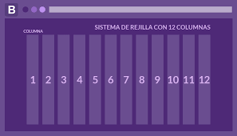

# Introducción a Bootstrap

## ¿Qué es Bootstrap y para qué sirve bootstrap?

Bootstrap es un framework de desarrollo web gratuito y de código abierto. Está diseñado para facilitar el proceso de desarrollo de los sitios web responsivos y orientados a los dispositivos móviles, proporcionando una colección de sintaxis para diseños de plantillas.

## ¿Cómo usar bootstrap?

Hay diferentes formas de descargar este framework. Una de ellas es descargando la versión compilada de los códigos CSS y JavaScript en la página de Bootstrap.

También hay una opción para descargar el código fuente del framework, puesto que es una herramienta de código abierto.

Aquellos que no quieran descargar los archivos pueden acceder a la estructura sin necesidad de instalarlos en el servidor. En la práctica, los archivos de instalación están en otro dominio, o sea en otro DNS.

Para eso, tan solo debemos usar los enlaces para acceder o Bootstrap CDN y, de esa forma, agregarle las referencias a los archivos necesarios para su uso.

Otra forma de descargar el framework es a través de los administradores de paquetes. Es importante decir que Bootstrap se puede usar con diferentes lenguajes de programación.

Por esta razón, puede ser descargado como npm, desde Node.js, con RubyGems, Composer o Nuget, y usarse para crear un sitio web en WordPress, en sitios desarrollados en Ruby on Rails, Asp.Net, etc.

## CDN Bootstrap

```HTML
<link rel="stylesheet" href="https://cdn.jsdelivr.net/npm/bootstrap@5.2.3/dist/css/bootstrap.min.css" integrity="sha384-rbsA2VBKQhggwzxH7pPCaAqO46MgnOM80zW1RWuH61DGLwZJEdK2Kadq2F9CUG65" crossorigin="anonymous">
```

```HTML
<script src="https://cdn.jsdelivr.net/npm/bootstrap@5.2.3/dist/js/bootstrap.min.js" integrity="sha384-cuYeSxntonz0PPNlHhBs68uyIAVpIIOZZ5JqeqvYYIcEL727kskC66kF92t6Xl2V" crossorigin="anonymous"></script>
```

## Sistema de rejillas de bootstrap


